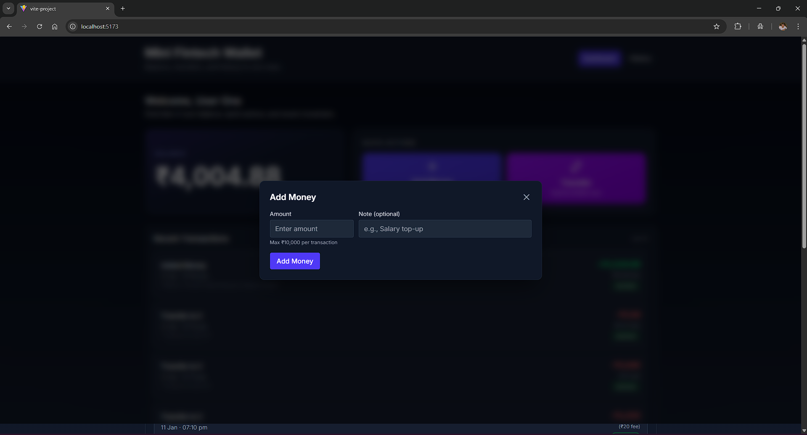
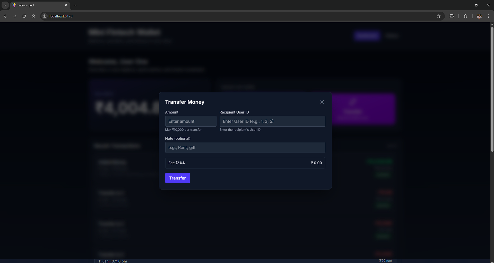
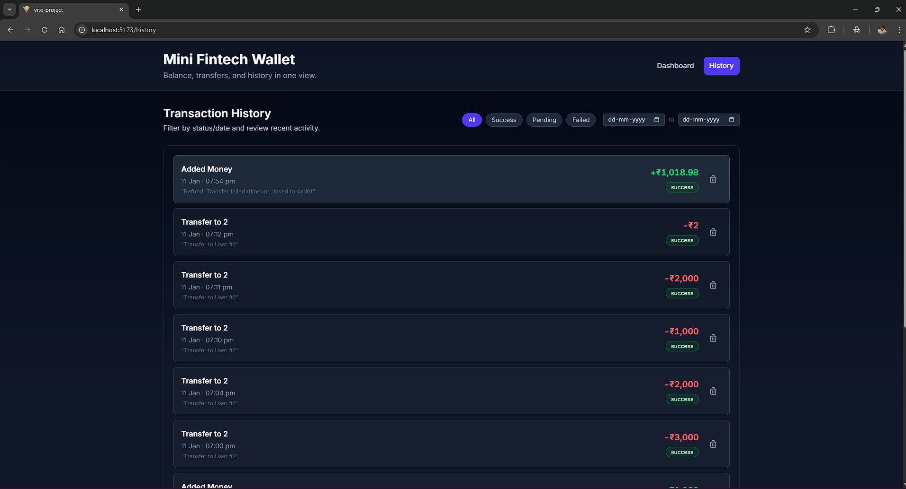
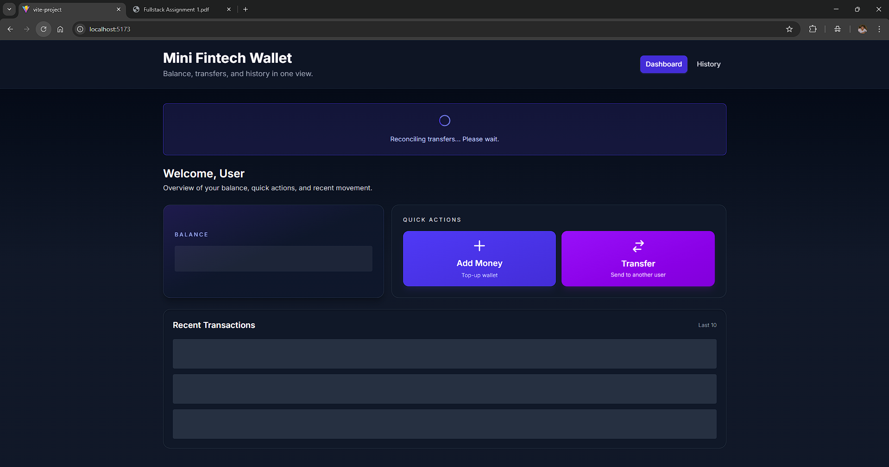

# Mini FinTech Wallet

A mini wallet web app to view balance, add/transfer money, and track transactions, built with React (Vite) and a mock API (json-server). Demonstrates API integration, state management, business rules, error handling, and testing.

## Setup & Run

1. **Install dependencies**
   ```bash
   npm install
   ```
2. **Start mock API** (json-server)
   ```bash
   npm run mock:api
   ```
   - Serves `db.json` at http://localhost:3001
3. **Start frontend** (Vite)
   ```bash
   npm run dev
   ```
   - App runs at http://localhost:5173

## Testing

- Run all tests:
  ```bash
  npm test
  ```
- Coverage: `vitest --coverage`
- Integration, unit, and component tests included (see `src/`)

## Architecture & Structure

- `src/pages/` – Route-level pages (Dashboard, History)
- `src/components/common/` – Shared UI (ErrorBoundary, TransactionList)
- `src/components/forms/` – Forms (AddMoneyForm, TransferMoneyForm)
- `src/components/modals/` – Dialogs (TransferConfirmationModal)
- `src/services/` – API client (axios)
- `src/config/` – Fee, limit, user constants
- `src/utils/` – Validation helpers

## Features & Business Rules

- **Dashboard**: Shows wallet balance, last 10 transactions, loading/empty states
- **Add Money**: Form with validation, updates balance, records "credit" transaction
- **Transfer Money**: Form with recipient, amount, note; applies 2% fee (configurable), enforces ₹10,000 per-transaction limit (configurable); confirmation modal; records "debit" and "fee" transactions
- **Transaction History**: List with filters (date range, status), soft delete/undo, loading/empty/error states
- **Business Rules**:
  - Fee: 2% (configurable in `src/config/constants.js`)
  - Limit: ₹10,000 per transaction (configurable)
  - Status: "pending" → "success"/"failed" (with reason)
  - Balance: Derived from transaction sum (credits – debits – fees)
- **Error Handling**: Toasts, inline messages, global error boundary, loading skeletons
- **Security**: Input validation, no unsafe HTML, no secrets in repo

## API Endpoints (Mocked)

- `GET /users` – List users
- `GET /transactions` – List transactions
- `POST /transactions` – Create transaction
- `PATCH /transactions/:id` – Update status
- `DELETE /transactions/:id` – Soft delete

See `db.json` for mock data and structure.

## Assumptions

- Single active user (`CURRENT_USER_ID`)
- Amounts in INR; fee/limit configurable
- Data persists only while json-server runs

## Limitations

- No authentication or multi-user switching
- Data resets on json-server restart (no real persistence)
- No pagination for history (all transactions loaded; dashboard shows last 10)

## Screenshots

### Dashboard


### Add Money



### Transfer Money



### Transaction History



### Loading State



## Documentation

## How to Test

1. Run `npm test` for all tests (unit, component, integration)
2. Coverage: `vitest --coverage`
3. Integration test: Add Money flow (`src/integration/AddMoney.integration.test.jsx`)
4. 10+ tests across forms, pages, and utils

---
